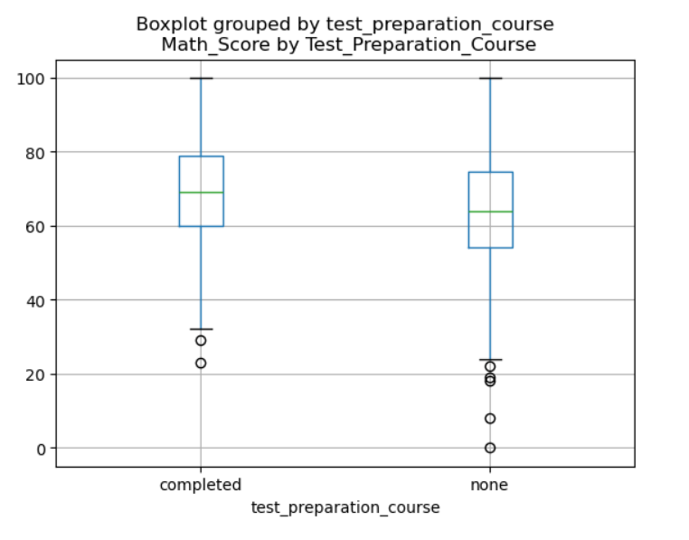
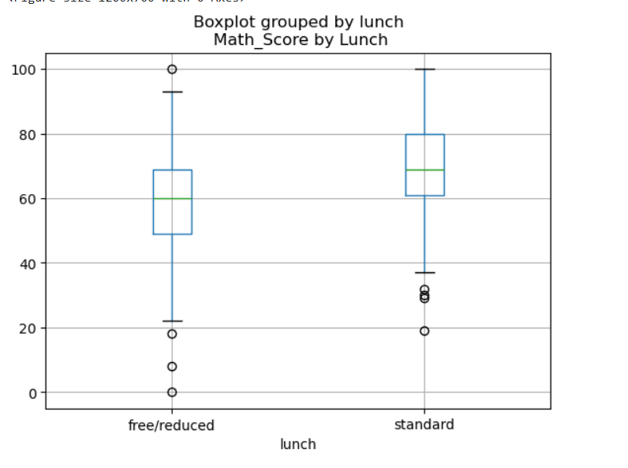
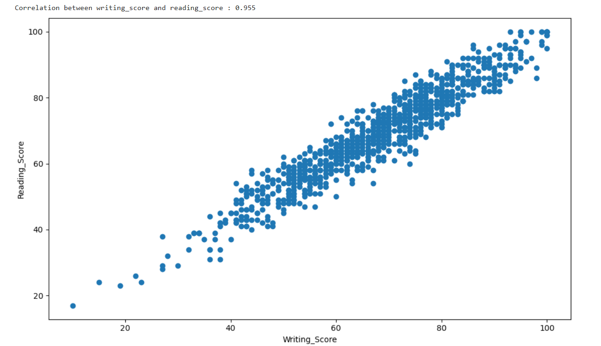
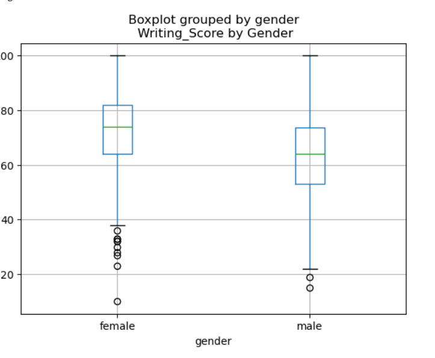
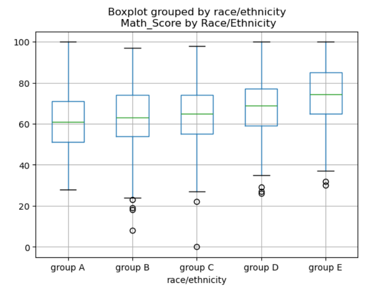

# Student Performance Analysis and Prediction

## 📊 Project Overview

This project analyzes factors affecting student academic performance using data from 1,000 students. The goal is to identify key drivers of success and build predictive models to help educators and policymakers make data-driven decisions to improve student outcomes.

## 🎯 Objectives

- Understand how demographic and socioeconomic factors influence student performance
- Identify the most impactful factors on academic success
- Analyze correlations between different subject scores

- Provide actionable recommendations for educational interventions

## 📁 Dataset

- **Source**: Students Performance Dataset
- **Size**: 1,000 student records
- **Features**:
  - Demographics: Gender, Race/Ethnicity
  - Socioeconomic: Parental Level of Education, Lunch Type (standard/free-reduced)
  - Academic: Test Preparation Course Completion
  - Performance: Math Score, Reading Score, Writing Score

## 🔍 Key Findings

### 1. Test Preparation Impact
- Students who completed test preparation scored **7** points higher on average
- Impact was consistent across all subjects (Math: **5** pts, Reading: **7** pts, Writing: **10** pts)
- 

### 2. Socioeconomic Factors
- **Lunch Type**: Students with standard lunch outperformed those with free/reduced lunch by **8** points
- **Parental Education**: Students whose parents held bachelor's degrees or higher scored **11** points higher than those whose parents had high school education

- 

### 3. Subject Correlations
- Strong positive correlation between subjects:
  - Math & Reading: **0.818**
  - Math & Writing: **0.803**
  - Reading & Writing: **0.955**
- This suggests students who excel in one subject tend to perform well across all subjects
- 

### 4. Gender Differences
- Females outperformed males in Reading by **7** points and Writing by **9** points
- Males showed slightly higher performance in Math by **5** points
-  
- 

### 5. Race/Ethnicity Patterns
- **Group E** showed highest average scores (73 points)
- Score gap between highest and lowest performing groups: **12** points
-  

## 📈 Model Performance


## 💡 Recommendations

Based on the analysis, here are actionable recommendations for improving student performance:

1. **Expand Test Preparation Programs**
   - Test prep shows the strongest controllable impact on scores
   - Prioritize access for economically disadvantaged students

2. **Parental Engagement Initiatives**
   - Create programs to help parents support their children's education
   - Focus on families where parents have lower educational attainment

3. **Address Socioeconomic Disparities**
   - Students from lower-income backgrounds (free/reduced lunch) need additional support
   - Consider tutoring programs, mentorship, or after-school resources

4. **Targeted Subject Support**
   - Given strong correlations between subjects, improving foundational skills benefits all areas
   - Focus on reading comprehension as it correlates strongly with all subjects

5. **Gender-Specific Interventions**
   - Encourage male students in reading and writing through engaging content
   - Promote female participation in advanced math programs

## 🛠️ Technologies Used

- **Programming Language**: Python 3.x
- **Development Environment**: Jupyter Notebook
- **Libraries**:
  - `pandas` - Data manipulation and analysis
  - `numpy` - Numerical computations
  - `matplotlib` - Data visualization
  - `seaborn` - Statistical visualizations
  - `scikit-learn` - Machine learning and predictive modeling

## 📂 Project Structure

```
student-performance-analysis/
│
├── StudentsPerformance.csv          # Dataset
├── analysis.ipynb                    # Main analysis notebook
├── README.md                         # Project documentation
└── requirements.txt                  # Python dependencies (if applicable)
```

## 🚀 Getting Started

### Prerequisites
```bash
pip install pandas numpy matplotlib seaborn scikit-learn
```

### Running the Analysis
1. Clone this repository
2. Ensure the dataset `StudentsPerformance.csv` is in the project directory
3. Open `analysis.ipynb` in Jupyter Notebook
4. Run all cells sequentially

## 📊 Visualizations

The project includes comprehensive visualizations:
- Distribution plots for all categorical variables
- Histograms showing score distributions
- Correlation scatter plots between subjects
- Box plots comparing scores across demographic groups


## 🔮 Future Work

- [ ] Implement additional machine learning models (Random Forest, Gradient Boosting)
- [ ] Perform statistical hypothesis testing to validate findings
- [ ] Create interactive dashboard for exploring the data
- [ ] Analyze interaction effects between multiple factors
- [ ] Build separate models for each subject (Math, Reading, Writing)
- [ ] Investigate non-linear relationships in the data

## 📝 Insights and Limitations

### Key Insights
- **Controllable factors matter**: Test preparation shows the largest impact among factors schools can directly influence
- **Compounding effects**: Multiple disadvantages (low parental education + free/reduced lunch + no test prep) create significant performance gaps
- **Universal patterns**: Strong subject correlations suggest holistic educational approaches are effective

### Limitations
- Dataset represents a specific population and may not generalize to all schools
- Causation cannot be definitively established from observational data
- Some factors (like teaching quality, student motivation) are not captured in the dataset
- Sample size of 1,000 students may not capture rare patterns or outliers

## 👤 Author

**[Joshua Achire]**
- GitHub: [@your-username](https://github.com/your-username)
- LinkedIn: [Joshua Achire](https://linkedin.com/in/joshua-achire)
- Email: achirejoshua@gmail.com


## 🙏 Acknowledgments

- Dataset source: [Add source if publicly available]
- Inspired by the goal to make education more equitable and data-driven

---


